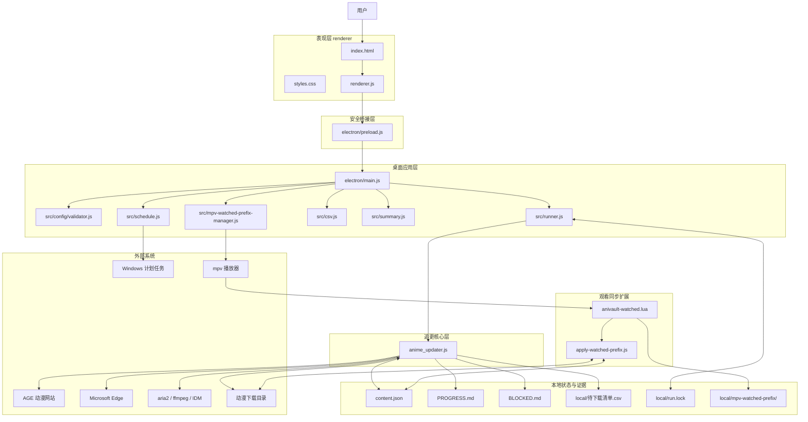
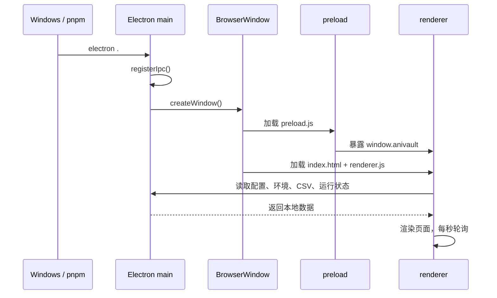
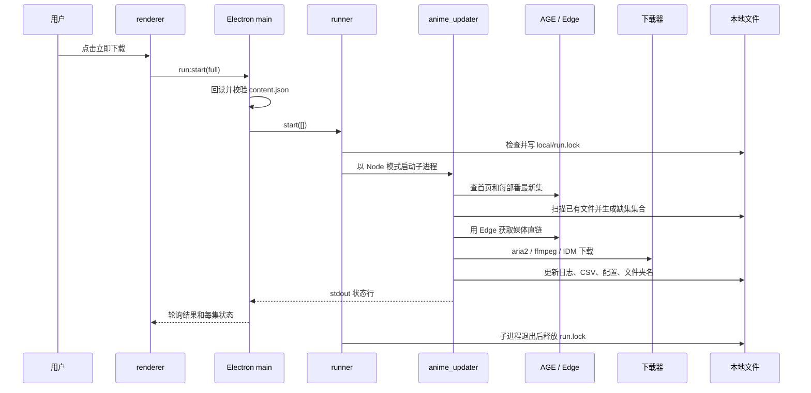

# 番仓 AniVault 项目框架全景指南

> 基于当前工作区源码整理，代码版本以 `package.json`、`VERSION` 和界面版本徽标为准，当前为 **0.11.1**。本文描述的是项目现在真实存在的结构和调用链，不是未来设想。

## 1. 先用一句话理解这个项目

AniVault 是一个运行在 Windows 上的本地 Electron 桌面程序。用户在界面里维护追番配置，Electron 主进程负责安全地读写本地文件、启动或停止更新器子进程、同步 Windows 计划任务；真正的查站、判断缺集、抓取媒体地址、调用下载器、更新进度和改文件夹名，主要由根目录的 `anime_updater.js` 完成。

可以先把它想成一家小仓库：

- `renderer/` 是前台柜台，负责展示和收集用户输入。
- `electron/preload.js` 是柜台与后台之间的受控窗口。
- `electron/main.js` 是后台值班经理，接收请求并调度工作。
- `anime_updater.js` 是仓库里的核心作业班组，真正执行追更。
- `src/` 是几个已经拆出的专职岗位，如校验、进程管理、计划任务、日志和锁。
- `content.json`、CSV、日志和下载目录是业务数据。
- `integrations/mpv-watched-prefix/` 是独立的观看进度扩展。

## 2. 总体框架图



这张图中最重要的边界有两条：

1. 网页页面不能直接使用 Node.js 或任意读写磁盘，只能通过 preload 暴露的固定接口请求主进程。
2. Electron 主进程不亲自执行完整追更，而是通过 `src/runner.js` 拉起 `anime_updater.js` 子进程。

## 3. 项目实际采用的技术形态

项目不是前后端分离的网站，也没有服务器和数据库。它是一个单机桌面应用：

| 项目 | 当前实现 |
| --- | --- |
| 桌面外壳 | Electron |
| 页面 | 原生 HTML、CSS、浏览器 JavaScript |
| 业务运行时 | Node.js CommonJS |
| 浏览器自动化 | `playwright-core` 驱动本机 Edge |
| 配置存储 | `content.json` |
| 待下载清单 | UTF-8 BOM CSV |
| 运行日志 | `PROGRESS.md`、`BLOCKED.md` |
| 视频下载 | aria2、ffmpeg、可选 IDM |
| 自动运行 | Windows `schtasks.exe` + VBS 隐藏启动器 |
| 观看同步 | mpv Lua 脚本 + Node.js 落盘助手 |
| 测试 | Node 内置 test runner，加少量自制脚本检查 |

这里没有路由框架、状态管理库、ORM 或数据库。原因很简单：当前需求全部发生在一台 Windows 电脑上，本地 JSON 和文件系统已经足够。

## 4. 六层结构逐层拆解

### 4.1 第一层：表现层

对应文件：

- `renderer/index.html`
- `renderer/styles.css`
- `renderer/renderer.js`

这一层只负责用户看得到和点得到的内容：

- 全局配置表单
- 追番卡片的增删改
- dry-run、立即下载、停止按钮
- 当前运行状态和每集下载状态
- `PROGRESS.md` 的尾部日志
- 待下载 CSV 的表格
- mpv 观看同步的安装、启停、更新和卸载按钮

`renderer.js` 内部维护一个很小的页面状态对象：

```text
state
├─ config       当前配置
├─ running      更新器是否运行
├─ pid          子进程编号
├─ lastExit     上一次退出结果
├─ logProgress  日志尾部
├─ logPinned    日志是否自动跟随底部
├─ episodes     每集实时状态
└─ mpvSync      mpv 扩展状态
```

页面启动后会执行 `load()`，读取配置、环境信息、运行状态、CSV 和 mpv 状态；之后每秒执行一次 `poll()`，刷新子进程状态和日志。

这一层不应该承担的事情：

- 不直接读写 `content.json`。
- 不直接执行 PowerShell、下载器或计划任务。
- 不自己判断一集是否应该下载。
- 不信任表单输入，最终校验仍由主进程完成。

### 4.2 第二层：安全桥接层

对应文件：`electron/preload.js`

Electron 窗口采用：

```text
contextIsolation = true
nodeIntegration = false
```

这表示普通网页代码拿不到 Node.js 的 `fs`、`child_process` 等能力。`preload.js` 使用 `contextBridge` 只暴露固定的 `window.anivault` API，例如：

| 页面方法 | IPC 通道 | 用途 |
| --- | --- | --- |
| `readConfig()` | `config:read` | 读取配置 |
| `saveConfig(cfg)` | `config:save` | 校验、保存并同步计划任务 |
| `runStart(mode)` | `run:start` | 启动 dry-run 或正式下载 |
| `runStop()` | `run:stop` | 停止当前子进程 |
| `runStatus()` | `run:status` | 查询运行状态 |
| `logTail(n)` | `log:tail` | 读取日志尾部 |
| `csvRead()` | `csv:read` | 读取待下载清单 |
| `csvSkip(payload)` | `csv:skip` | 永久跳过某集 |
| `csvRemove(payload)` | `csv:remove` | 仅删除当前 CSV 行 |
| `mpvSync*()` | `mpv-sync:*` | 管理 mpv 扩展 |

这一层几乎没有业务逻辑。它的意义是缩小权限面：页面只能调用列出来的能力，不能随意操作电脑。

### 4.3 第三层：Electron 主进程应用层

对应文件：`electron/main.js`

这是桌面应用的组装中心。它主要负责五类工作。

#### 窗口生命周期

`app.whenReady()` 后注册 IPC，再根据启动参数选择：

- 普通模式：创建主窗口。
- `--smoke`：确认窗口能加载并输出 `SMOKE_OK`。
- `--selftest`：用临时数据做桌面端到端自检。
- `--screenshot`：自动截图供界面检查。

#### 配置读写

保存路径是：

```text
renderer collectConfig()
  → preload saveConfig()
  → ipcMain config:save
  → validateConfig()
  → atomicWriteJson(content.json)
  → syncSchedule()
  → renderer 回读配置确认
```

`atomicWriteJson()` 先写临时文件，再重命名覆盖正式配置。这样比直接写正式文件更不容易留下半截 JSON。

#### 子进程调度

主进程通过 `createRunner()` 管理唯一的更新器子进程，并把 `AGE_RUN_MODE=interactive` 传给它。正式脚本输出普通日志和特殊的：

```text
EP_STATUS\t{"title":"...","ep":1,"status":"downloading"}
```

主进程识别这种行，转换成页面可展示的每集状态。

#### 本地文件和系统能力

主进程代替页面执行：

- 读取日志尾部。
- 读取、删除待下载 CSV 行。
- 将“永久跳过”写回 `content.json` 的 `skip_eps`。
- 统计动漫文件夹已有集数。
- 打开下载目录。
- 查询和同步 Windows 计划任务。

#### mpv 扩展管理

主进程懒加载 `src/mpv-watched-prefix-manager.js`，并通过五个固定 IPC 提供状态检查、安装、更新、启停和卸载。

### 4.4 第四层：可复用服务模块

对应目录：`src/`

这些模块是从主流程中拆出来、职责比较明确的零件。

| 文件 | 责任 | 不负责什么 |
| --- | --- | --- |
| `config/validator.js` | 校验时间、路径、整数、布尔值、模板占位符 | 不写配置，不替用户修正数据 |
| `runner.js` | 拉起和停止子进程、维护 `run.lock`、逐行读取输出 | 不理解追番业务 |
| `schedule.js` | 构造并执行 `schtasks.exe` 命令 | 不读页面，不运行下载器 |
| `csv.js` | 解析 CSV、删除精确行、读取文本尾部 | 不决定哪些集应该下载 |
| `summary.js` | 计算“已下载/总数”显示值 | 不扫描目录；扫描由调用者完成 |
| `logutil.js` | 追加日志、超过 2000 行时轮转、快速读尾部 | 不判断日志内容 |
| `folder-rename-lock.js` | 为下载器和 mpv 提供共享改名锁 | 不执行具体命名策略 |
| `mpv-watched-prefix-manager.js` | 安全部署和管理 mpv 脚本 | 不采样播放进度，不直接改动漫目录 |

这一层体现了项目当前的模块化边界：能被桌面端或扩展独立复用、能单独测试的能力，逐步放进 `src/`；但核心追更流程仍集中在 `anime_updater.js`。

### 4.5 第五层：核心业务与基础设施混合层

对应文件：`anime_updater.js`

这是整个项目最重要的文件，约 1100 行。它既是命令行入口，又包含业务规则、网站适配、下载器适配和文件系统操作。

内部可以按职责理解成九个区域：

1. 路径和环境解析
   - `getBase()`：`AGE_BASE > content.base_url > 默认网址`。
   - `getDownloadDir()`：`AGE_DLOAD > content.download_dir > D:\idm下载`。
   - 解析 CSV、ffmpeg、aria2、日志和锁路径。

2. 网络访问
   - `fetchText()`：30 秒超时，普通网络错误重试一次，超时不重试。
   - 请求带 `Connection: close` 和浏览器 User-Agent。

3. AGE 网站适配
   - `searchSite()`：按片名搜索站内条目。
   - `parseHomeUpdateTimes()`：只接受严格 `HH:MM`。
   - `getMaxEp()`：从详情页得到指定线路的最大集数。
   - `getPlayUrl()`：用无头 Edge 监听媒体请求并读取播放器页面。

4. 命名和文件夹匹配
   - `applyTemplate()`：套用文件夹或文件名模板。
   - `matchFolderTemplate()`：从现有目录名反解析模板变量。
   - `resolveFolderName()`、`resolveFileName()`：生成目标名称。
   - `findFolder()`、`getEpisodeFileMatcher()`：定位番剧目录和集数文件。

5. 下载器适配
   - `callAria2()`、`callFfmpeg()`、`callIdm()`。
   - `engineChain()` 决定尝试顺序。
   - M3U8 固定使用 ffmpeg。
   - 非交互运行不会尝试 IDM。

6. 下载可靠性
   - 五条播放线路依次兜底。
   - 线路 1 取址失败额外重试一次。
   - 下载文件达到最小体积且稳定一段时间才算完成。
   - 使用上一集时长判断当前文件是否明显残缺。
   - 可以恢复合格的 `.part.mp4`，避免重复下载。
   - Windows 临时占用导致改名失败时有限重试。

7. 单部番业务编排
   - `processOneAnime()` 补齐字段、找目录、判断缺集、执行下载、推进进度、改名。

8. 全局业务编排
   - `processAllAnime()` 获取首页时刻表，逐部处理，写回配置和 CSV，最后关闭浏览器池。

9. 程序入口
   - `main()` 识别 `--dry-run` 和旧式 `--install-task`，准备日志，读取配置并进入全局编排。

需要特别理解：所谓“核心层”和“基础设施层”在这个项目里还没有完全分开。例如 `processOneAnime()` 是业务逻辑，但同一文件里的 `callFfmpeg()` 是外部工具适配。这是当前真实结构，不影响使用，但会增加阅读这个文件的难度。

### 4.6 第六层：外部集成与运行环境

项目依赖的外部系统包括：

| 外部对象 | 作用 | 连接位置 |
| --- | --- | --- |
| AGE 动漫网站 | 搜索、详情、播放页数据来源 | `anime_updater.js` |
| Microsoft Edge | 执行动态播放页并截获媒体地址 | `getPlayUrl()` |
| aria2 | 默认下载 MP4 | `callAria2()` |
| ffmpeg | 下载 M3U8、兜底 MP4、读取媒体时长 | `callFfmpeg()`、`getMediaDurationSeconds()` |
| IDM | 交互模式下的可选 MP4 下载器 | `callIdm()` |
| Windows 计划任务 | 每日自动启动 | `src/schedule.js` |
| mpv | 播放并采样观看行为 | Lua 扩展 |
| Windows 文件系统 | 保存配置、日志、状态和视频 | 多个模块 |

## 5. 启动阶段与运行阶段不要混在一起

理解这个项目时，最容易混淆的是“桌面面板启动”和“追更任务运行”。它们是两条不同的链。

### 5.1 桌面面板启动链



这时还没有开始查网站或下载视频。

### 5.2 用户点击“立即下载”的运行链



### 5.3 dry-run 的区别

dry-run 仍然会访问网站、读取配置和扫描目录，也会补齐部分元数据并生成待下载清单；但不会创建下载目录、不会下载视频，也不会改名。它的用途是验证“程序认为应该做什么”。

## 6. 核心追更算法

对每一部启用的动漫，`processOneAnime()` 实际按下面的顺序工作：

```text
检查 enabled
  ↓
缺 site_id → 按片名搜索并补齐
  ↓
缺 update_time → 从首页时刻表补齐或写 null
  ↓
缺 downloaded_start/end → 尝试从旧目录名恢复
  ↓
按 folder_name 模板或旧规则找到目录
  ↓
必要时创建目录或迁移目录名
  ↓
扫描已有集数文件
  ↓
已有文件数少于 downloaded_end？
  ├─ auto_repair=true  → 把缺失旧集加入修复集合
  └─ auto_repair=false → 写 BLOCKED 并停止处理该番
  ↓
查询站内最新集 maxEp
  ↓
计算新集 + 修复集 - skip_eps
  ↓
写入待下载清单 rows
  ↓
dry-run？是 → 返回
  ↓ 否
按 max_parallel 并发下载
  ↓
成功项从 CSV 剩余清单中剔除
  ↓
按成功的最高集推进 downloaded_end
  ↓
根据新 end 改文件夹名
```

几个容易误会的业务规则：

- `downloaded_end` 是“进度权威值”，并不等于当前文件个数。
- `auto_repair` 会检查 1 到 `downloaded_end` 之间的缺集。
- `skip_eps` 会从待处理集合中永久排除指定集。
- “删除 CSV 行”只是删当前清单，不会写 `skip_eps`，下次检查仍可能出现。
- 一批并发下载部分成功时，成功的最高集仍可推进 `downloaded_end`，失败集以后由缺集修复再次发现。
- `max_download=0` 表示不限制本次新增集数；正数才限制从当前 end 往后的新集。

## 7. 下载决策框架

### 7.1 媒体线路

程序按站内线路 `1 → 2 → 3 → 4 → 5` 尝试。每条线路先用 Edge 打开播放页并寻找真正的媒体 URL。

### 7.2 下载引擎链

| 媒体类型 / 用户选择 | 实际尝试顺序 |
| --- | --- |
| M3U8，任何选择 | ffmpeg |
| MP4，aria2 | aria2 → ffmpeg |
| MP4，ffmpeg | ffmpeg → aria2 → IDM |
| MP4，IDM | IDM → aria2 → ffmpeg |

如果运行模式不是 `interactive`，链中的 IDM 会被移除。因此计划任务默认不会依赖需要桌面交互的 IDM。

### 7.3 一次下载何时算成功

程序不只看子进程是否启动，还会检查结果文件：

- 文件达到最小体积，目前是 100 MiB。
- 文件大小保持稳定，目前稳定窗口是 120 秒。
- 如果有上一集作为参照，当前视频时长不能明显短于上一集，门槛为 80%。
- 临时文件合格后才改成正式文件名。

这套规则的目标是避免“下载器启动成功”被误认为“视频真正完整”。

## 8. 数据层与唯一事实来源

### 8.1 `content.json`

这是追番配置和下载进度的唯一主要事实来源。

```json
{
  "fetch_time": "18:00",
  "base_url": "https://www.agedm.io",
  "download_dir": "D:\\视频",
  "defaults": {
    "max_download": 10,
    "max_parallel": 3,
    "download_engine": "aria2",
    "attempt_timeout_min": 20,
    "auto_repair": true,
    "auto_close_idm": true
  },
  "anime": {
    "示例片名": {
      "enabled": true,
      "site_id": 123456,
      "update_time": "22:30",
      "downloaded_start": 1,
      "downloaded_end": 8,
      "site_latest": 9,
      "skip_eps": [3],
      "folder_name": "{watched}_{name}{start}_{end}",
      "file_name": "{name}_{ep}.mp4"
    }
  }
}
```

重要字段关系：

| 字段 | 谁写入 | 谁读取 | 含义 |
| --- | --- | --- | --- |
| `fetch_time` | 页面 | 计划任务模块 | 每日自动运行时间，空值关闭 |
| `base_url` | 页面 | 更新器 | AGE 基础网址 |
| `download_dir` | 页面 | 主进程、更新器 | 下载根目录 |
| `defaults.*` | 页面 | 更新器 | 全局下载策略 |
| `anime.*.site_id` | 页面或更新器自动补齐 | 更新器 | 站内条目编号 |
| `downloaded_end` | 页面或更新器 | 更新器 | 已推进到的最高集 |
| `site_latest` | 更新器 | 页面、更新器 | 最近查到的站内集数 |
| `skip_eps` | 页面或“跳过此集” | 更新器 | 永久排除的集数 |
| `folder_name` | 页面 | 更新器、mpv 扩展 | 文件夹模板 |
| `file_name` | 页面 | 更新器、mpv 扩展 | 视频文件模板 |

页面保存时会重新组装它认识的字段。按当前 `collectConfig()` 实现，页面不认识的顶层字段、`defaults` 字段或单番字段可能在保存时丢失；`validator` 的“未知字段原样保留”测试只证明校验器本身不改输入，并不能证明整个页面保存链会保留未知字段。这与 README 的“未知字段保留”描述不完全一致，是本文发现的第二处文档或实现漂移。修改配置结构时必须同时检查 renderer 的收集逻辑和 validator。

### 8.2 `PROGRESS.md`

记录正常运行过程。更新器每次调用 `progress()` 时同时：

- 输出到 stdout，供面板捕获。
- 追加到 `PROGRESS.md`。

超过 2000 行时由 `appendRotated()` 保留尾部并写轮转标记。面板只快速读取末尾若干行。

### 8.3 `BLOCKED.md`

记录无法自动裁决的失败，如站点搜索失败、下载失败、目录冲突。它是故障证据，不是待下载清单。

### 8.4 `local/待下载清单.csv`

这是一次检查得到的“尚需处理项目”的派生视图，不是权威进度：

- dry-run 会保留全部计划项。
- 正式运行后会移除成功项，只留下失败或未完成项。
- 如果本次查询全部失败且没有生成任何行，会保留上一次 CSV，避免用空结果覆盖有用证据。

### 8.5 锁和临时状态

| 路径 | 用途 |
| --- | --- |
| `local/run.lock` | 防止同时启动两个更新器 |
| `local/mpv-watched-prefix/folder-rename.lock` | 防止更新器和 mpv 同时改动漫目录名 |
| `local/mpv-watched-prefix/state.json` | 已累计的观看状态 |
| `local/mpv-watched-prefix/session-*.jsonl` | 一次 mpv 会话的追加事件 |
| `local/mpv-watched-prefix/install-state.json` | 受管部署记录及哈希 |
| `local/mpv-watched-prefix/enabled.flag` | 扩展启停开关 |

## 9. 配置校验框架

`src/config/validator.js` 是保存和运行前共同使用的边界校验器。当前规则包括：

- `fetch_time` 和单番 `update_time` 必须是严格 `HH:MM`。
- `download_dir` 必须是 Windows 绝对路径或 UNC 路径。
- `max_parallel` 为 1 至 10 的整数。
- `attempt_timeout_min` 为 5 至 60 的整数。
- 下载引擎只能是 `aria2`、`idm`、`ffmpeg`。
- `enabled`、`auto_repair`、`auto_close_idm` 必须是布尔值。
- 集数和站内编号必须满足对应的非负或正整数规则。
- 文件夹和文件模板不能含 Windows 非法字符。
- 文件模板只允许 `{name}{ep}{start}{end}`。
- 文件夹模板额外允许 `{watched}`，且最多出现一次。

为什么页面校验后，启动前还要再校验一次？因为 `content.json` 可能在面板之外被手工修改。真正执行任务前重新校验，才能守住运行边界。

## 10. 并发与两把锁

项目有两类并发，不能混为一谈。

### 10.1 集数下载并发

`runPool(items, worker, max_parallel)` 允许一部番的多个缺集并发处理。每个任务拥有自己的浏览器 context，但同一轮运行共享一个 Edge browser 实例。

这减少了反复启动 Edge 的成本，同时避免多个页面上下文互相污染。

### 10.2 任务单实例锁

`src/runner.js` 使用 `local/run.lock` 保存子进程 PID：

- 内存中已有 child 时，拒绝重复启动。
- 锁里的 PID 仍存活时，拒绝新任务。
- PID 已死亡时，旧锁可被新运行替换。
- 子进程退出或报错时释放属于自己的锁。

### 10.3 文件夹改名共享锁

更新器和 mpv 扩展都可能改同一个动漫目录，因此共同使用 `folder-rename.lock`。锁文件包含持有者、PID、时间和随机 token；释放时还会核对 token，防止误删别人的锁。

对于死亡进程留下的锁，只有超过十分钟才视为陈旧，并会先保留 stale 证据再尝试一次，而不是无条件抢锁。

## 11. Windows 自动运行框架

当前桌面面板使用的新任务链是：

```text
保存 content.json
  → syncSchedule(fetch_time)
  → schtasks.exe 创建/更新 AniVaultAutoRun
  → 到点调用 wscript.exe
  → scripts/auto-run.vbs
  → 设置 ELECTRON_RUN_AS_NODE=1、AGE_RUN_MODE=password
  → 隐藏启动 electron.exe anime_updater.js
```

`auto-run.vbs` 根据自身路径向上寻找项目根目录，因此项目目录移动后脚本本身不需要写死新路径；但计划任务保存的是 VBS 的绝对路径，所以移动项目后仍需从新目录启动面板并保存一次。

根更新器中还保留 `AGEAnimeUpdater`、`--install-task`、`task_state.json` 这条旧任务链。当前面板的 `src/schedule.js` 不使用它。阅读代码时要把“兼容遗留代码”和“当前桌面主路径”分开。

## 12. mpv 观看同步子系统

这是项目中相对独立的一套扩展，分为部署、采样、结算三部分。

### 12.1 部署管理

`src/mpv-watched-prefix-manager.js` 负责：

- 验证 mpv 根目录包含 `mpv.exe` 和 `portable_config`。
- 把 Lua 脚本安装到 `portable_config/scripts/`。
- 生成脚本配置到 `portable_config/script-opts/`。
- 记录部署文件 SHA-256。
- 安装后默认停用。
- 外部修改部署文件时拒绝直接覆盖或卸载。
- 用事务记录和备份在安装失败时回滚。

它维护的状态机大致为：

```text
not-installed
  → install
disabled
  ↔ set-enabled
enabled
  → 源码变化后 update-available
  → 部署文件被别人修改后 external-change
```

### 12.2 播放采样

`anivault-watched.lua` 在 mpv 启动时先读 `enabled.flag`。不是 `yes` 就立即返回，不注册任何事件和计时器。

启用后它：

- 只接受 Windows 本地绝对路径视频。
- 每秒采样一次。
- 暂停、缓存暂停、seek 和 idle 时不累计有效观看时间。
- 记录最大播放位置。
- 每十秒把增量追加到本次 `session-*.jsonl`。
- 只有 mpv 正常 shutdown 时才启动 Node.js 结算助手。

### 12.3 结算和改名

`apply-watched-prefix.js` 会：

1. 读取所有遗留和当前 session 事件。
2. 按 session 和 seq 去重，避免重复累计。
3. 从视频路径和模板唯一匹配动漫与集数。
4. 累计真实有效观看时长与最大播放位置。
5. 达到双门槛后生成合格事件。
6. 获得共享文件夹改名锁。
7. 只替换 `folder_name` 中的 `{watched}` 值。
8. 成功后原子写入 `state.json`。

当前代码中的双门槛是：

- 有效观看累计达到视频时长的 45%。
- 最大播放位置达到视频时长的 90%。

这两个条件必须同时满足。README 的当前版本说明已经记录 0.11.1 的 45% + 90% 规则；其中 0.10.0 的旧版本记录仍保留当时的双 90% 历史口径。理解现在的运行行为时，应看 0.11.1 说明、当前代码和测试，不要把旧版本记录当成当前规则。

启用观看同步还要求某部番的 `folder_name` 中恰好出现一次 `{watched}`。没有该占位符表示不参与；多个占位符会被配置校验拒绝。

## 13. 文件目录地图

```text
项目根目录
├─ anime_updater.js                 核心追更入口和主要业务逻辑
├─ content.json                     配置与下载进度事实来源
├─ package.json                     Electron 入口、命令、依赖、版本
├─ VERSION                          纯文本版本号
├─ README.md                        项目概览和开发入口
├─ 使用说明.md                      面向使用者的详细手册
├─ PROGRESS.md                      正常运行日志，用户现场数据
├─ BLOCKED.md                       异常与待裁决记录
├─ task_state.json                  旧计划任务链状态
├─ electron/
│  ├─ main.js                       Electron 主进程和 IPC
│  └─ preload.js                    受控页面 API
├─ renderer/
│  ├─ index.html                    页面结构
│  ├─ styles.css                    页面样式与响应式布局
│  └─ renderer.js                   页面状态、表单和轮询
├─ src/
│  ├─ config/validator.js           配置边界校验
│  ├─ runner.js                     子进程与单实例锁
│  ├─ schedule.js                   Windows 计划任务
│  ├─ csv.js                        CSV 读写
│  ├─ summary.js                    清单汇总
│  ├─ logutil.js                    日志追加、轮转、读尾
│  ├─ folder-rename-lock.js         共享目录改名锁
│  └─ mpv-watched-prefix-manager.js mpv 部署状态机
├─ integrations/mpv-watched-prefix/
│  ├─ anivault-watched.lua          mpv 播放采样
│  ├─ apply-watched-prefix.js       观看事件结算和目录改名
│  ├─ README.md                     扩展说明
│  ├─ DESIGN.md                     设计约束
│  └─ tests/                        扩展专项测试
├─ scripts/
│  ├─ auto-run.vbs                  无窗口计划任务入口
│  └─ auto-run.cmd                  手工调试入口
├─ tests/                            主项目自动测试
├─ docs/                             设计记录
├─ tools/                            本机 aria2、ffmpeg，Git 忽略
├─ node_modules/                     本机依赖，Git 忽略
└─ local/                            运行产物和本地文档，Git 忽略
```

## 14. 测试框架在保护什么

`pnpm test` 不是只跑一种测试，而是组合执行：

```text
node tests/run-tests.js
  + node --test tests/*.test.js
  + node --test integrations/.../tests/*.test.js
  + node tests/ui-check.js
```

当前覆盖重点可以按层理解：

| 层 | 主要测试 |
| --- | --- |
| 配置边界 | 时间、数值范围、Windows 路径、模板、启停、跳过集 |
| 核心规划 | 新集范围、缺集修复、跳过、部分成功推进 |
| 下载可靠性 | 下载引擎链、超时、媒体时长、临时文件恢复、改名重试 |
| 网络韧性 | 超时、重试、单番失败隔离、首页失败降级、基础网址优先级 |
| 运行器 | 子进程、PID 锁、重复启动、停止、stdout 分行 |
| 计划任务 | 创建、更新、删除、VBS 隐藏启动契约 |
| 本地数据 | CSV、日志轮转、日志读尾、汇总显示 |
| UI 静态约束 | 关键元素、样式和界面结构 |
| mpv 扩展 | 部署哈希、事务安全、启停、Lua 契约、双门槛、去重、冲突拒绝 |

另外还有三个面向完整应用的命令：

- `pnpm run smoke`：窗口能否加载。
- `pnpm run selftest`：临时配置读写和假脚本运行端到端。
- `pnpm run screenshot <path>`：生成界面截图用于视觉检查。

单元测试通过不等于真实 AGE 网站、Edge、下载器和下载目录全部可用；这些外部依赖仍需一次 dry-run 或受控实跑验证。

## 15. 错误处理与证据链

项目没有把所有错误都变成致命退出，而是按影响范围处理：

| 故障 | 当前策略 |
| --- | --- |
| `content.json` 无法解析 | 整次运行失败，写 BLOCKED |
| 首页时刻表失败 | 写 BLOCKED，继续逐部处理 |
| 单部番失败 | 写 BLOCKED，继续下一部 |
| 某一线路失败 | 尝试下一线路 |
| 某下载引擎失败 | 按引擎链尝试下一引擎 |
| 某一集失败 | 标记该集失败，其他并发集继续 |
| 全部查询失败且 CSV 无新行 | 保留旧 CSV |
| 文件夹目标已存在 | 拒绝覆盖，写 BLOCKED |
| 改名锁忙 | 不抢锁，保留错误信息 |
| mpv 部署文件被外改 | 标记 `external-change`，拒绝覆盖或卸载 |

排查一次失败时，应沿着下面的证据顺序看：

1. 面板运行状态和每集状态。
2. `PROGRESS.md` 的最后几十行。
3. `BLOCKED.md` 是否有对应时间的记录。
4. `local/待下载清单.csv` 是否仍保留失败集。
5. 下载目录内正式文件、`.part.mp4`、`.failed` 文件。
6. `local/run.lock` 或共享改名锁是否存在及其 PID。
7. 只有 mpv 问题才看 `local/mpv-watched-prefix/` 的 session、state 和 log。

## 16. 当前架构的优点与真实限制

### 优点

- 本地优先，没有服务器、账号系统和数据库维护成本。
- Electron 页面与 Node 权限通过 preload 隔离。
- 更新器可脱离 GUI 单独运行和测试。
- 多层兜底覆盖网站线路、下载引擎和残留文件恢复。
- 配置、日志、CSV 都是人能直接打开的普通文件。
- 对危险文件操作采用原子写、目标冲突拒绝、共享锁和部署哈希。
- 外部站点或单部番失败不会轻易拖垮整批任务。

### 限制

- `anime_updater.js` 过于集中，业务规则、网站解析、下载器和文件系统耦合较高。
- AGE 页面的 HTML、播放器 frame 和媒体请求特征一变，解析逻辑可能失效。
- Edge 与 IDM 路径带有本机默认值，跨电脑需要重新核对。
- JSON 和 CSV 没有事务数据库提供的并发一致性，只靠进程边界、原子写和锁保护关键路径。
- renderer 通过每秒轮询获取多数状态，不是完整的事件驱动状态同步。
- 新旧两套计划任务代码共存，容易让维护者误读。
- README 中同页保留了 mpv 旧版和新版门槛，阅读时要结合版本号，后续行为变更仍需同步所有当前说明入口。
- 当前只适配一个站点，多站点扩展和安装包仍属于明确未完成范围。

这些限制是维护边界，不代表现在必须重构。只有当实际需求或故障反复击中某个限制时，才值得拆分。

## 17. 修改功能时应该落在哪一层

| 需求 | 首先检查的文件 |
| --- | --- |
| 改页面布局、标签或按钮 | `renderer/index.html`、`styles.css`、`renderer.js` |
| 新增页面可调用的系统能力 | `preload.js` + `electron/main.js` |
| 新增配置字段 | renderer 收集/渲染 + validator + updater + 文档 + 测试 |
| 改计划任务行为 | `src/schedule.js`、启动脚本、相关 IPC |
| 改进程单实例或停止逻辑 | `src/runner.js` |
| 改 AGE 页面解析 | `anime_updater.js` 网站适配函数 |
| 改缺集和进度规则 | `processOneAnime()` 及规划辅助函数 |
| 改下载器优先级 | `engineChain()`、`downloadEpisode()` |
| 改文件/文件夹模板 | updater 模板函数 + validator + mpv 匹配逻辑 |
| 改日志和轮转 | `src/logutil.js` |
| 改待下载 CSV | updater 写入 + `src/csv.js` + main IPC + renderer 表格 |
| 改 mpv 安装管理 | `src/mpv-watched-prefix-manager.js` |
| 改观看判定 | Lua 采样 + `apply-watched-prefix.js` 结算 +专项测试 |

配置字段尤其容易跨层。以新增一个全局字段为例，通常至少要同时考虑：

```text
HTML 控件
→ renderer.render()
→ renderer.collectConfig()
→ validator
→ content.json 兼容默认值
→ anime_updater 使用点
→ 测试
→ README / 使用说明 / 版本显示
```

漏掉其中一环，就可能出现“界面能填但保存丢失”“保存成功但运行不生效”或“手工配置绕过界面后崩溃”。

## 18. 推荐的源码阅读顺序

为了最快建立整体认识，按下面顺序阅读最省力：

1. `package.json`：知道入口、命令、版本和依赖。
2. `README.md`：知道产品当前范围。
3. `electron/main.js` 的 `registerIpc()`：看桌面端能做什么。
4. `electron/preload.js`：看页面和系统之间的接口。
5. `renderer/renderer.js` 的 `load()`、`save()`、`poll()`、`startRun()`：看用户动作怎样发出。
6. `src/runner.js`：看更新器怎样成为独立子进程。
7. `anime_updater.js` 的 `main()`、`processAllAnime()`、`processOneAnime()`：先看总编排。
8. `downloadEpisode()`、`getPlayUrl()`、三个下载器函数：再看下载细节。
9. `src/config/validator.js` 和测试：确认数据边界。
10. 有观看同步需求时再读 mpv 三个核心文件。

不要从 `anime_updater.js` 第一行一路顺序读到底。先抓住三个编排函数，再向下追它们调用的辅助函数，会清楚很多。

## 19. 开发与验收入口

常用命令：

```powershell
Set-Location D:\project_codex\260814_animeinstall_auto

# 启动桌面面板
pnpm run start

# 只检查计划，不实际下载
node .\anime_updater.js --dry-run

# 执行自动测试
pnpm test

# 桌面窗口加载检查
pnpm run smoke

# 桌面端到端自检
pnpm run selftest
```

一次改动至少应回答四个问题：

1. 改的是哪一层，是否越过了原本边界？
2. 配置、运行时状态和日志中，哪一个是这项数据的事实来源？
3. 失败时会停止全局、停止单番，还是继续兜底？
4. 哪个自动测试或实际运行现象证明它生效？

项目约定的提交前检查是：

```powershell
pnpm test
git diff --check
git status --short --ignored
```

其中 `git status --short --ignored` 很重要，因为 `local/`、`tools/` 和 `node_modules/` 都是本机运行产物，不应被误提交。

## 20. 一页总结

```text
用户操作
  ↓
renderer 原生页面
  ↓ 固定 API
preload 安全桥
  ↓ IPC
Electron main 应用组装
  ├─ 配置校验与原子保存
  ├─ Windows 计划任务
  ├─ CSV / 日志 / 环境信息
  ├─ mpv 部署管理
  └─ runner 子进程管理
          ↓
    anime_updater 核心追更
      ├─ 读 content.json
      ├─ 请求 AGE
      ├─ Edge 抓媒体地址
      ├─ 计算新集和缺集
      ├─ aria2 / ffmpeg / IDM 下载
      ├─ 更新进度与目录名
      └─ 写 PROGRESS / BLOCKED / CSV

mpv 独立支线
  mpv Lua 采样
    → session JSONL
    → Node 结算助手
    → 双门槛判定
    → 共享锁
    → 更新 {watched} 文件夹前缀
```

如果只记住三个核心结论：

1. `electron/main.js` 是桌面端的组装和权限中心，`anime_updater.js` 才是追更业务核心。
2. `content.json` 是配置和进度事实来源，CSV 与日志是派生结果和运行证据。
3. 修改配置或命名规则通常会跨越 UI、桥接、校验、核心业务、mpv 扩展和测试，必须沿真实调用链一起核对。

---

## 附录：本文核对范围

本文逐项核对了当前工作区中的入口、页面、IPC、追更核心、`src/` 服务模块、计划任务脚本、mpv 扩展以及测试名称。没有修改业务源码、配置、日志或用户下载数据。工作区在整理前已经存在未提交修改，因此本文只描述当前磁盘上实际可见的代码，不把它等同于某个 Git 提交的纯净版本。
