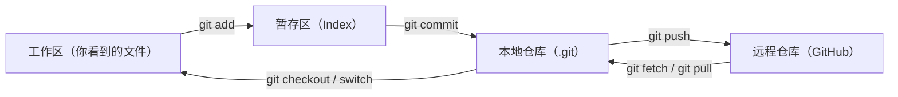

# GitHub 使用教程（从入门到实战）

> 本教程面向 Windows / PowerShell 用户，示例项目使用你的 `anime_updater` 仓库。
> 学习目标：看完这份文档，你能独立完成"使用别人的项目、托管自己的项目、给开源项目提 PR"三件事。

## 目录
啊伟大伟大
1. [GitHub 是什么](#1-github-是什么)
2. [准备工作：账号、Git、SSH](#2-准备工作账号gitssh)
3. [认识仓库页面](#3-认识仓库页面)
4. [使用者的三种姿势：看文档、下载、克隆](#4-使用者的三种姿势看文档下载克隆)
5. [把自己的项目放上 GitHub](#5-把自己的项目放上-github)
6. [核心概念速览](#6-核心概念速览)
7. [Fork + PR：参与开源项目的完整流程](#7-fork--pr参与开源项目的完整流程)
8. [团队协作：分支策略、评审、解决冲突](#8-团队协作分支策略评审解决冲突)
9. [Issues、Discussions、Projects](#9-issuesdiscussionsprojects)
10. [进阶功能：Actions、Releases、Pages](#10-进阶功能actionsreleasespages)
11. [常用命令速查表](#11-常用命令速查表)
12. [撤销与回滚指南](#12-撤销与回滚指南)
13. [常见问题 FAQ](#13-常见问题-faq)
14. [学习路线建议](#14-学习路线建议)

---

## 1. GitHub 是什么

GitHub 是一个**基于 Git 的代码托管和协作平台**。它做三件事：

- **托管**：把你的 Git 仓库放在云端，随时同步、备份。
- **协作**：提供 Issue、PR、代码评审、项目看板等功能，让多人一起开发。
- **社区**：全球最大的开源社区，几十亿行代码都在上面。

### Git 和 GitHub 的区别

| | Git | GitHub |
|---|---|---|
| 是什么 | 本地版本控制工具（命令行） | 云端的代码托管网站 |
| 在哪运行 | 你自己的电脑 | 服务器（网站） |
| 负责什么 | 记录历史、管理分支 | 存储远程仓库 + 协作功能 |
| 类比 | 相机 | 相册网站 |

一句话：**Git 是工具，GitHub 是用这个工具把代码存到网上并协作的地方。**

---

## 2. 准备工作：账号、Git、SSH

### 2.1 注册账号

访问 [github.com](https://github.com)，注册一个免费账号（GitHub 账号通常也是登录其他开发者工具的重要凭证，值得认真设置密码和两步验证）。

### 2.2 安装 Git

到 [git-scm.com](https://git-scm.com) 下载安装，一路下一步即可。安装后打开 PowerShell 验证：

```powershell
git --version
# 输出类似：git version 2.53.0.windows.3
```

### 2.3 告诉 Git 你是谁（必须，否则无法提交）

```powershell
git config --global user.name "你的名字"
git config --global user.email "你的邮箱"
git config --global --list   # 查看已保存的配置
```

`--global` 表示对所有仓库生效。这步不做，commit 时会报错 `Please tell me who you are`。

### 2.4 选择连接方式：HTTPS 或 SSH

和 GitHub 远程仓库通信有两种方式：

| 方式 | 特点 | 适合谁 |
|---|---|---|
| HTTPS | 用账号名 + Token 登录，配置简单 | 新手推荐 |
| SSH | 用密钥对，配置一次后不用输密码 | 常用/长期开发者 |

### 2.5 HTTPS 方式：创建 Personal Access Token

GitHub 已经不接受密码 push，需要生成一个 Token 当密码用：

1. 右上角头像 → **Settings** → **Developer settings**。
2. **Personal access tokens** → **Tokens (classic)** → **Generate new token**。
3. 勾选 `repo`（仓库读写权限），生成后**立即复制保存**（只显示一次）。
4. push 时用户名填账号，密码粘贴 Token 即可。

### 2.6 SSH 方式（推荐长期使用）

```powershell
# 生成密钥（一路回车即可）
ssh-keygen -t ed25519 -C "你的邮箱"

# 查看公钥内容
Get-Content ~\.ssh\id_ed25519.pub
```

复制输出的整行内容，粘贴到 GitHub：

**Settings → SSH and GPG keys → New SSH key**，保存后测试：

```powershell
ssh -T git@github.com
# 成功会看到：Hi 用户名! You've successfully authenticated...
```

以后克隆地址选择 SSH 格式（`git@github.com:用户名/仓库.git`）就不用再输密码。

---

## 3. 认识仓库页面

打开任意 GitHub 仓库，顶部和右侧有这些重要元素：

| 元素 | 作用 |
|---|---|
| 仓库名 `作者/仓库名` | 仓库的唯一标识 |
| `README.md` | 主页显示的项目说明文档，**使用项目先看这里** |
| `Code` 下拉按钮 | 克隆地址（HTTPS/SSH）和 Download ZIP |
| `Star` | 收藏/点赞，表示对这个项目感兴趣 |
| `Watch` | 订阅项目动态（版本发布、讨论等通知） |
| `Fork` | 把整个仓库复制到自己账号下 |
| `Issues` 标签 | 问题、Bug、需求清单 |
| `Pull requests` 标签 | 待合并的代码请求 |
| `Actions` 标签 | 自动化工作流（CI/CD） |
| `Releases` | 官方发布的版本包（安装包/压缩包） |
| `About` 面板 | 项目描述、主题标签、许可证、语言统计 |
| 右侧 Contributors | 参与贡献的人 |

新手最容易忽略的是：**仓库主页最上方通常就有 README 的安装和使用说明**，其次是 Releases 里的成品包。

---

## 4. 使用者的三种姿势：看文档、下载、克隆

### 4.1 姿势一：看文档（最重要）

任何项目先看三样东西：

1. 主页的 `README.md`：安装、使用、配置说明。
2. `Releases`：有没有现成的成品包。
3. 项目的 `Wiki` 或 `docs/` 目录（如果有）。

### 4.2 姿势二：Download ZIP

Code → **Download ZIP**。

适合：只是想看代码、临时用一下。注意：ZIP 里**没有 `.git`**，不是 Git 仓库，不能更新、不能看历史。

### 4.3 姿势三：Clone（克隆到本地）

```powershell
git clone https://github.com/作者/仓库名.git
```

适合：以后想随时 `git pull` 更新、想修改代码。

```powershell
cd 仓库名
git pull   # 以后每次获取作者的最新更新
```

### 4.4 优先级建议

> **Releases 成品包 > 看 README > Clone > ZIP**

用别人的程序不一定需要 Git；需要参与修改时，Git 才真正派上用场。

---

## 5. 把自己的项目放上 GitHub

### 5.1 在 GitHub 新建空仓库

1. 右上角 **+** → **New repository**。
2. 填仓库名（如 `anime_updater`）。
3. Public（公开）或 Private（私有）自选。
4. 如果本地已有代码，**不要勾选** "Add a README" / ".gitignore" / "License"，保持空仓库。
5. 创建后页面会显示空仓库的推送命令，照着做即可。

### 5.2 本地已有仓库：关联远程并推送

你的 `anime_updater` 仓库已经关联了远程：

```powershell
git remote -v
# 会看到 origin  https://github.com/heathfris/AGE-_GET.git
```

如果还没有，执行：

```powershell
git remote add origin https://github.com/你的用户名/仓库名.git
```

推送本地分支并建立关联（`-u` 表示记住关联，以后直接 `git push`）：

```powershell
git push -u origin master
```

之后刷新 GitHub 页面，你的代码和历史就都在线了。

### 5.3 全新项目：完整创建流程

```powershell
cd 你的项目文件夹
git init                 # 1. 初始化本地仓库
git add .                # 2. 把文件加入暂存区
git commit -m "first commit"   # 3. 创建第一个提交
git branch -M main       # 4. 把分支改名为 main（GitHub 默认名）
git remote add origin https://github.com/你的用户名/仓库名.git
git push -u origin main  # 5. 推送到 GitHub
```

### 5.4 日常更新循环

```powershell
git status               # 1. 看看有什么改动
git add .                # 2. 选择要提交的改动（. 表示全部）
git commit -m "feat: 添加了 xxx"  # 3. 提交
git pull                 # 4. 先同步远程别人的改动（防止冲突）
git push                 # 5. 推上去
```

### 5.5 .gitignore：哪些文件不该提交

仓库根目录的 `.gitignore` 用来声明"永远不跟踪"的文件，例如：

```gitignore
node_modules/
.env
__pycache__/
*.log
temp/
```

注意：已经被 Git 跟踪的文件，再写进 `.gitignore` 不会生效，需要先取消跟踪：

```powershell
git rm --cached 文件名
git commit -m "chore: stop tracking 文件名"
```

---

## 6. 核心概念速览



| 概念 | 一句话解释 |
|---|---|
| Commit | 一次内容快照，有唯一哈希 ID 和说明文字 |
| 分支 Branch | 指向某个提交的可移动指针，代表一条独立开发线 |
| HEAD | "我现在在哪"的标记，指向当前分支 |
| 远程 Remote | 云端仓库（默认叫 origin） |
| 标签 Tag | 给某个提交打固定名字（如 v1.0.0），用于发布版本 |
| Fork | 在 GitHub 上把仓库复制到自己账号下 |
| PR | 请求把分支改动合并进目标分支 |
| Issue | 问题/需求清单 |

**为什么能回滚**：每次 commit 保存的是不可变的对象（文件内容 blob + 目录 tree + 提交 commit），它们按哈希存储、永不修改。回滚只是把分支指针移回旧提交，所以历史能完整保留。

---

## 7. Fork + PR：参与开源项目的完整流程

### 7.1 什么时候用 Fork

没有原仓库写权限时（绝大多数开源项目），用 Fork 获得自己账号下的副本，改完通过 PR 把改动送回原仓库。

### 7.2 完整流程（8 步）

**第 1 步：Fork**

打开目标项目 → 点右上角 **Fork** → 完成后你账号下多了一个副本。

**第 2 步：克隆你的 fork 到本地**

```powershell
git clone https://github.com/你的用户名/项目名.git
cd 项目名
```

**第 3 步：建功能分支（不要直接在 master 上改）**

```powershell
git checkout -b fix-some-bug
```

**第 4 步：修改代码并提交**

```powershell
git add .
git commit -m "fix: 修复了 xxx 问题"
```

**第 5 步：推送到你的 fork**

```powershell
git push -u origin fix-some-bug
```

**第 6 步：发起 PR**

推送后 GitHub 页面会出现黄色提示条 **Compare & pull request**，点击后填写：

- 标题：说明改了什么（如 `fix: 修复下载超时问题`）。
- 正文：描述问题、改动内容、测试结果，可附带截图。
- 左侧选择原仓库的目标分支（通常是 main），右侧选你 fork 里的分支。

**第 7 步：评审与修改**

维护者会在 PR 里评论或逐行提意见。你继续修改后：

```powershell
git add .
git commit -m "fix: 根据 review 修改"
git push
```

PR 会自动更新，不需要重新发起。

**第 8 步：合并**

维护者点击 Merge 后，PR 关闭，你的代码进入原项目。你的 fork 可以留着，也可以删除。

### 7.3 保持 fork 与上游同步

原仓库一直在更新，你的 fork 会落后。同步方法：

```powershell
# 第一次：添加上游（原仓库）地址
git remote add upstream https://github.com/原作者/项目名.git

# 之后每次同步
git fetch upstream
git checkout master
git merge upstream/master
git push
```

---

## 8. 团队协作：分支策略、评审、解决冲突

### 8.1 推荐的分支策略（GitHub Flow）

- `main`：永远可用的稳定分支，**受保护**，不能直接 push。
- 每个任务开一条分支：`feature/xxx`、`fix/xxx`、`docs/xxx`。
- 完成工作 → 开 PR → 评审通过 → 合并回 main。

```powershell
git checkout -b feature/download-idm
# ... 开发 ...
git push -u origin feature/download-idm
# 在 GitHub 上开 PR
```

### 8.2 代码评审（Code Review）

PR 页面可以：

- 在具体代码行上留评论（Review comments）。
- 提交整体意见：Comment / Approve（通过）/ Request changes（要求修改）。
- 查看 CI（Actions）是否通过，通过前禁止合并。

### 8.3 合并冲突是什么

两个人改了同一文件的同一行时，Git 无法自动判断谁对谁错，就产生冲突。文件里会出现：

```text
<<<<<<< HEAD
这是 main 上的版本
=======
这是你分支上的版本
>>>>>>> feature/xxx
```

解决步骤：

1. 打开冲突文件，手动保留正确内容，删掉 `<<<<<<<`、`=======`、`>>>>>>>` 标记。
2. 保存后：

```powershell
git add 文件名
git commit -m "merge: 解决 xxx 冲突"
git push
```

### 8.4 保护分支（Branch protection）

在仓库 **Settings → Branches → Add rule** 可设置：

- 禁止直接 push main。
- 必须通过 PR 才能合并。
- 至少一个评审通过。
- CI 检查必须通过。

这是团队项目防止"手滑破坏主线"的核心手段。

### 8.5 提交信息规范

推荐格式：`类型(范围): 简述`

```text
feat: 新增 IDM 自动关闭功能
fix: 修复文件名模板识别错误
docs: 更新使用说明
chore: 调整配置
refactor: 重构下载逻辑
test: 添加测试
```

---

## 9. Issues、Discussions、Projects

### 9.1 Issues：事务清单

适合报 Bug、提需求、派任务。要素：

- 标题 + 正文（Bug 要写复现步骤、期望/实际行为、环境信息）。
- Labels：`bug`、`enhancement`、`good first issue`（新手友好）、`help wanted`。
- Assignees：指派负责人。
- Milestones：关联版本计划。

PR 合并时可以自动关闭 Issue：

```text
fixes #12
```

### 9.2 Discussions：开放讨论区

适合提问、头脑风暴、公告，比 Issue 更随意：

| | Issues | Discussions |
|---|---|---|
| 用途 | 具体任务 | 开放讨论 |
| 编号 | 有（#12） | 无 |
| 状态 | Open / Closed | 无关闭概念 |
| 分类 | 无 | Q&A、Ideas、Announcements、Polls |

许多项目规定：**先讨论确认，再开 Issue 或写 PR**。

### 9.3 Projects：看板

把 Issues 和 PR 拖进 To do / In progress / Done 列，做轻量项目管理。

---

## 10. 进阶功能：Actions、Releases、Pages

### 10.1 GitHub Actions（自动化）

在仓库 `.github/workflows/` 下放 YAML 文件，GitHub 会在 push、PR、定时等时机自动执行任务（测试、构建、发布）。示例骨架：

```yaml
name: CI
on: [push, pull_request]
jobs:
  test:
    runs-on: ubuntu-latest
    steps:
      - uses: actions/checkout@v4
      - run: npm test
```

### 10.2 Releases（发布版本）

1. 打标签并推送：

```powershell
git tag v1.0.0
git push --tags
```

2. 仓库页面 **Releases → Draft a new release**，选标签、写更新日志、上传安装包。

发布后用户可以在 Releases 页直接下载成品。

### 10.3 GitHub Pages（免费静态网站）

仓库 **Settings → Pages**，选择分支后，你的 README/HTML 会发布成网站，地址形如：

```text
https://你的用户名.github.io/仓库名/
```

适合做项目主页、文档站、个人博客。

### 10.4 Star / Watch / Fork 的意义

- **Star**：收藏，方便以后找回来，也是给作者的支持。
- **Watch**：订阅更新通知。
- **Fork**：参与开发的第一步。

---

## 11. 常用命令速查表

### 仓库操作

| 命令 | 作用 |
|---|---|
| `git init` | 初始化仓库 |
| `git clone 地址` | 克隆远程仓库 |
| `git remote -v` | 查看远程地址 |
| `git remote add origin 地址` | 添加远程仓库 |
| `git remote set-url origin 新地址` | 修改远程地址 |

### 日常提交

| 命令 | 作用 |
|---|---|
| `git status` | 查看状态 |
| `git diff` | 查看未暂存的改动 |
| `git add 文件` / `git add .` | 加入暂存区 |
| `git commit -m "说明"` | 提交 |
| `git log --oneline` | 查看简洁历史 |
| `git show 提交号` | 查看某次提交详情 |

### 分支

| 命令 | 作用 |
|---|---|
| `git branch` | 列出本地分支 |
| `git branch -a` | 列出所有分支（含远程） |
| `git checkout -b 名字` | 新建并切换分支 |
| `git switch -c 名字` | 同上（新版命令） |
| `git checkout 分支名` / `git switch 分支名` | 切换分支 |
| `git merge 分支名` | 合并分支到当前分支 |
| `git branch -d 分支名` | 删除分支 |

### 远程同步

| 命令 | 作用 |
|---|---|
| `git fetch` | 只下载远程改动，不合并 |
| `git pull` | fetch + 自动合并（推荐 `git pull --rebase`） |
| `git push` | 推送本地提交 |
| `git push -u origin 分支` | 首次推送并建立关联 |

### 其他

| 命令 | 作用 |
|---|---|
| `git stash` | 暂时藏起未提交改动 |
| `git stash pop` | 恢复暂存改动 |
| `git tag v1.0.0` | 打标签 |
| `git reflog` | 查看所有指针移动记录（救命命令） |
| `git help 命令` | 查看命令帮助 |

---

## 12. 撤销与回滚指南

先分清改动在哪个阶段，再选命令：

| 场景 | 命令 | 说明 |
|---|---|---|
| 工作区改了但没 add | `git restore 文件` | 丢弃该文件的修改 |
| add 了但没 commit | `git restore --staged 文件` | 取消暂存，内容保留 |
| commit 了但没推送 | `git reset --soft HEAD~1` | 撤销提交，改动留在暂存区 |
| commit 了但没推送 | `git reset --hard HEAD~1` | 彻底回退，**改动会丢** |
| 已经推送了 | `git revert 提交号` | 生成反向提交，安全，历史不丢失 |
| 找不到提交了 | `git reflog` | 找回所有曾经存在的提交 |

注意：

- `reset` 会改写本地历史，**不要**对已推送的共享分支使用。
- `revert` 不删历史，只是再提交一个"反过来"的改动，适合远程。
- 强制覆盖远程用 `git push --force-with-lease`（比 `--force` 安全），但必须清楚后果。

---

## 13. 常见问题 FAQ

**Q1：`git commit` 报错 `Please tell me who you are`**

没配置身份。执行：

```powershell
git config --global user.name "名字"
git config --global user.email "邮箱"
```

**Q2：`remote origin already exists`**

已经关联过远程，改用修改地址：

```powershell
git remote set-url origin 新地址
```

**Q3：`push rejected (non-fast-forward)`**

远程有你本地没有的提交。先同步再推：

```powershell
git pull --rebase
git push
```

**Q4：push 要求输入用户名密码，密码不对**

用 Personal Access Token 当密码（见第 2.5 节），或改用 SSH。

**Q5：`Permission denied (publickey)`**

SSH 密钥没配置好。检查 `~\.ssh\id_ed25519.pub` 是否已添加到 GitHub，并测试 `ssh -T git@github.com`。

**Q6：克隆别人的仓库后 push 报 403**

没有写权限。正确做法：Fork → 克隆自己的 fork → push → 发起 PR。

**Q7：`.gitignore` 不生效**

文件已经被跟踪了。用 `git rm --cached 文件` 取消跟踪后重新提交。

**Q8：改了大文件，push 很慢或被拒**

单个文件超过 100MB GitHub 会拒绝。大文件用 [Git LFS](https://git-lfs.com)。

**Q9：不小心提交了密码/密钥**

1. 立即去 GitHub 撤销该 Token / 改密码（泄露的凭据必须作废）。
2. 用 `git filter-repo` 等工具重写历史（会改写所有提交哈希，需团队配合）。

**Q10：master 还是 main？**

GitHub 新仓库默认 `main`。老项目/本地仓库可能是 `master`，名字不重要，团队约定一致即可。

---

## 14. 学习路线建议

### 第 1 周：本地 Git

- 在 `anime_updater` 仓库里练习：修改 → add → commit → log → 分支 → merge。
- 学会 `git status` 和 `git diff`，随时知道自己在哪、改了什么。

### 第 2 周：GitHub 托管

- 把你的项目推上去（你的仓库已经配好 origin，只差一次 `git push -u origin master`）。
- 练习：新建仓库、克隆、pull、push、.gitignore。

### 第 3 周：参与开源

- 找一个 `good first issue` 项目，走一遍 Fork → 分支 → PR 流程。
- 先做文档、翻译、修错别字类的小贡献，风险低、反馈快。

### 推荐资源

- [Pro Git 中文版（免费书）](https://git-scm.com/book/zh/v2)
- [Git 官方文档](https://git-scm.com/doc)
- [GitHub Skills（官方互动课程）](https://skills.github.com)

---

最后记住三句话：

1. **使用项目看 README，参与项目才用 Git。**
2. **主线永远保持可用，新功能都在分支上做。**
3. **已提交的内容基本丢不了；没提交的内容才可能丢。**
